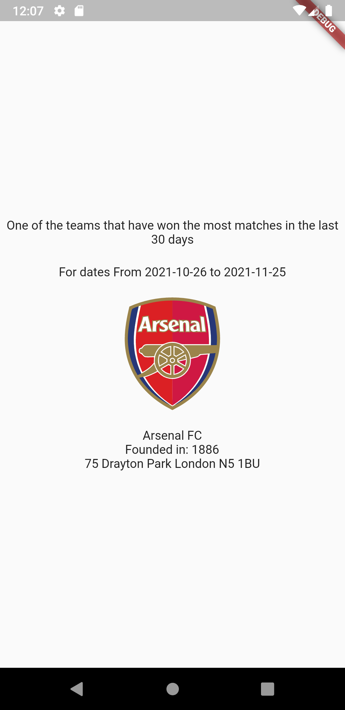

# Flutter example - Football Stats

This is flutter project shows one of the top winning football teams in the last 30 days in the Premier League.

Project includes unit test and dependency inversion.

Data from https://www.football-data.org/

## Main App Dependencies

🐸  RiverPod - For state managment and Dependencie injection

🗄️  Retrofit - HTTP client

🥶  Freezed - For Immutable objects

⏲️  Jiffy = Date and time Package

